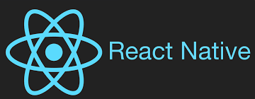

# React Native Boot Camp

<p align="right">
  
</p>

> The future of Mobile Applications is here! 📲
> Are you ready for it? 👓


#### Index

1. [Objective](#objective)

2. [Who Should Attend](#who-should-attend)

3. [Duration](#duration)

4. [Technical Assistance](#technical-assistance)

5. [Performance Measurement](#performance-measurement)

6. [Handling advanced Developers](#handling-advanced-developers)

7. [Tools](#tools)

8. [General Guidelines](#general-guidelines)

9. [Proposed Test Applications](#proposed-test-applications)

10. [Environment Setup](#environment-setup)

11. [Learning Days](#learning-days)

12. [Introduction](#introduction)

    * [Topic 0: Getting started](#topic-0-getting-started)

    * [Topic 1: UI - ReactJS](#topic-1-ui---reactjs)

    * [Topic 2: Prop & State](#topic-2-props-state)

    * [Topic 3: Style](#topic-3-style)

    * [Topic 4: Components](#topic-4-components)

    * [Topic 5: Handling touches](#topic-5-handling-touches)

    * [Topic 6: Networking](#topic-6-networking)

    * [Topic 7: Navigation - StackNavigator](#topic-7-navigation---stacknavigator)

    * [Topic 8: Navigation - TabNavigator](#topic-8-navigation---tabnavigator)

    * [Topic 9: Navigation - DrawerNavigator](#topic-9-navigation---drawernavigator)

    * [Topic 10: Redux](#topic-10-redux)

13. [Commits](#commits)

14. [Reviews](#reviews)

### Objective

This course teaches the basics of React Native development. We want to help you create the best of breed user experiences and mobile applications.

→ [index](#index)

### Who Should Attend

The training will start at a low level, and does not require in depth knowledge of the platform in question. Desirable participant profile: trainees and outside Globant candidates. A basic knowledge on HTML, CSS, and JavaScript, React is desired, though.
For React you can check React + Redux Bootcamp

→ [index](#index)

### Duration

Five weeks total.

Three weeks for guided learning and two weeks for app development.

→ [index](#index)

### Technical Assistance

You can contact other bootcamp participants or any available tutor if you need technical assistance. We will create one chat for boot camp members only, and another one for boot camp members and tutors when boot camp starts.

### Performance Measurement

1. Code review after each practice and sprint

2. Checkpoint completion after Learning stage with your assigned tutor

→ [index](#index)


### Handling Advanced Developers

Developers that move faster than average can go ahead and complete as much exercises as wanted.

→ [index](#index)

### Tools

1. If you are on Windows you will need Android SDK and android emulator or device. 
   On Linux you will need Android SDK and android emulator or device.
   On Mac you can add Xcode and iOS Simulator or Android SDK and android emulator or device.

   Note: For Android we recommend installing Andoid Studio, that comes with SDK

2. Install Node and NPM [NodeJS LTS](https://nodejs.org/en/download/)

3. The IDE to use is [Visual Studio Code](https://www.visualstudio.com/downloads/). But you can use the edit of your choice Atom, Sublime, WebStorm, etc

4. Skype Account + headset (audio calls), Slack

5. Create your own[ GitHub](https://github.com/) account. Follow this[ guideline](https://help.github.com/articles/set-up-git) to setup your account.

→ [index](#index)


### General Guidelines

The boot camp is organized in the following way:

1. The first three weeks will be used for intensive self learning. Each topic will have reading and practices parts. Tutors will be available to answer technical questions on a given chat room.

2. The next two weeks will be used to develop an application following a life process.

3. The project manager will coordinate learning days encouraging team communication in daily meetings.

4. The project manager will gather information regarding individual progress so we can look for alternative assistance where needed.

5. The project manager will lead the boot camp sprints as if it were a real project using SCRUM agile methodology.

6. Two boot camp chats will be created for feedback and technical assistance:

    1. Bootcamp React Native - ALL
Every person participating in the bootcamp is present here (students, tutors and PMs). Here is the place to ask for technical assistance!

    2. Bootcamp React Native - Assistants
Here you will reach just your boot camp fellows for asking question sharing knowledge.

7. Team play is encouraged but the work will be evaluated per person.

8. Sprint duration will be 1 week.

9. The instructions will be vague as they generally are in real life projects. You must look for support and guidance from your PM, teammates and tutors.

10. All code and documentation must be in English.

11. Code must adhere to Globant’s UI [HTML](https://github.com/globant-ui/html-style-guide), [CSS](https://github.com/globant-ui/css-style-guide) and [JavaScript](https://github.com/globant-ui/JavaScript-style-guide) coding guidelines.

→ [index](#index)

### Proposed Test Applications

The test application will consist in a Last.fm client.

→ [index](#index)

### Environment Setup

Documentation (https://facebook.github.io/react-native/docs/getting-started.html)

1. Install NodeJS

2. Install React Native client ```npm install -g react-native-cli```

3. Install watchman

→ [index](#index)

### Learning Days

Each day you will grab the fundamentals of the key building blocks for the next generation mobile apps.

On each learning day you will have to:

1. 📖 Read:
We will provide you with documentation related with current sprint content so you can have a background reference, guide and examples to complete the following practice.

2. ✍️ Practice: 
You will implement the previously gathered knowledge in simple coding activities.
Most important task numbers are listed in the "*Key Points*" section for each day and they should get most of your attention; if you feel you don’t have enough time to complete all tasks, start with these ones when possible.

3. 📬 Commit: 
You will commit all your code on a daily basis, when you finish your practice.

→ [index](#index)

### Introduction

At high level you could see the keys as:



React Native is like React, but it uses native components instead of web components as building blocks. So to understand the basic structure of a React Native app, you need to understand some of the basic React concepts, like JSX, components, state, and props. If you already know React, you still need to learn some React-Native-specific stuff, like the native components.

→ [index](#index)

#### Topic 0: Getting started

→ [index](#index)

##### 📖 Reading: #####

1. Start guide [Geting started](https://facebook.github.io/react-native/docs/getting-started.html)

#### Topic 1: UI - ReactJS

→ [index](#index)

##### 📖 Reading: #####

1. [What is ReactJS?](http://facebook.github.io/react/). [Here](http://www.instrument.com/latest/an-introduction-to-react-js) is an introduction to it.

2. First [get started with ReactJS](https://facebook.github.io/react/docs/getting-started.html) then [Think in React](https://facebook.github.io/react/docs/thinking-in-react.html).

3. Understand [Props & States](https://github.com/uberVU/react-guide/blob/master/props-vs-state.md).

4. Read about some ReactJS's [Best Practices, Patterns & Anti-patters](https://github.com/planningcenter/react-patterns).

5. Check some ReactJS's [Test utils](https://facebook.github.io/react/docs/test-utils.html).

6. Try on using [Reactify](https://github.com/andreypopp/reactify) [ReactJS + Browserify workflow](https://www.codementor.io/reactjs/tutorial/react-js-browserify-workflow-part-1).

7. Redux [Redux](http://redux.js.org/docs/introduction/) [React-Redux](http://redux.js.org/docs/basics/UsageWithReact.html)

##### Extra reading: #####

* [Full guide on ReactJS](https://scotch.io/tutorials/learning-react-getting-started-and-concepts).

* [Read some ReactJS tips](https://facebook.github.io/react/tips/introduction.html).

#### Topic 2: Props & State

→ [index](#index)

##### 📖 Reading: #####

1. Beginner [basic tutorial](https://facebook.github.io/react-native/docs/props.html#content)

2. Beginner [basic tutorial](https://facebook.github.io/react-native/docs/state.html#content)

#### Topic 3: Style

→ [index](#index)

##### 📖 Reading: #####

1. Beginner: React Native Style [basic tutorial](https://facebook.github.io/react-native/docs/style.html)

#### Topic 4: Components

→ [index](#index)

1. Beginner: Check the compoennts section and learn what they do [basic tutorial](https://facebook.github.io/react-native/docs/getting-started.html)

#### Topic 5: Handling touches

→ [index](#index)

1. Beginner: [Handling touches](https://facebook.github.io/react-native/docs/handling-touches.html)

#### Topic 6: Networking

→ [index](#index)

1. Beginner: [Networking](https://facebook.github.io/react-native/docs/network.html)

##### Extra documentation:#####

* Understanding ECMAScript 6: [https://leanpub.com/understandinges6/read](https://leanpub.com/understandinges6/read)

* [ECMAScript® 2015 Language Specification](http://www.ecma-international.org/ecma-262/6.0/) *For really advanced developers*

* Using Chrome console to debug JavaScript [https://developer.chrome.com/devtools/docs/console](https://developer.chrome.com/devtools/docs/console)

##### ✍️ Practice: #####

**Use Try to use as much ECMAScript 6 syntax as you can. Favor ```let``` and ```const``` over ```var```**

1. Create a new React Native proyect using the react native client.

2. In the root page create two lines of text - 1 - "Hello" and 2 - "World"

3. Add some styles to center the text and set a blue color

4. Add a button below the text, to your component.

5. Attach a touch event to the created button which calls a function that changes the text to 
"React Native" and "Bootcamp"

6. Add a list to the page

7. Create a service that fetches from ```https://jsonplaceholder.typicode.com/user```

8. Add a button and attach a touch event that loads the items in the list


##### Key Points: #####

3, 5, 8

##### 📲 Mobile Test: #####

Test your code in a mobile device or in Android emulator.

Hint: A good option to test your code in a mobile device is to use Genymotion Android Emulator [http://www.genymotion.com/], which is one of the most fast and easy mobile emulators to install.

##### Commit: #####

Commit your practice code.

→ [index](#index)

#### Topic 7: Navigation - StackNavigator
In this Topic we will focus on learning how to use the React Native navigation library. This library is a third party as the built in navigation was deprecated because of performance issues

##### 📖 Reading: #####

1. Documentation on the differente navigators can be found here[https://reactnavigation.org/](https://reactnavigation.org/)

2. Specific to StackNavigator [https://reactnavigation.org/docs/navigators/stack](https://reactnavigation.org/docs/navigators/stack)

##### ✍️ Practice: #####

1. Add a StackNavigator

2. Create a new page with two <Text> compoents

3. Inside each teaxt add ```name``` and ```email``` of the user

4. Using the previous work, add a touch event on the list items.

5. Add a touch event on the list items

6. When an item is touched we should naigate to the new page passing the user as an argument

7. Show ```name``` and ```email```in the <Text> components

##### Key Points:#####

1, 6, 7

##### Commit:#####

Commit your practice code.

→ [index](#index)

#### Topic 8: Navigation - TabNavigator

##### 📖 Reading: #####

1. [TabNavigator](https://reactnavigation.org/docs/navigators/tab).

##### ✍️ Practice: #####

1. Create a TabNavigator

2. Create 2 Screens for 2 of the tabs

3. On the third one add a nested StackNavigator with 2 Screens

4. In each screen add a <Text>{Number of screen}</Text> at the top. Example:

```html
<Text>Screen 1</Text> // Tab 1
<Text>Screen 2</Text> // Tab 2
<Stack>               // Tab 3
    <Text>Screen 3.1</Text> This is the default
    <Text>Screen 3.2</Text>
<Stack>
```

5. On screen 3.1 add a <Button> that when touched it navigates to Screeen 3.2

##### Key Points:#####

1, 4, 5

##### Mobile Test:#####

Test your code in a mobile device or in Android emulator.

##### Commit:#####

Commit your practice code.

→ [index](#index)

#### Topic 9: Navigation - DrawerNavigator

##### 📖 Reading: #####

1. [DrawerNavigator]: [https://reactnavigation.org/docs/navigators/drawer](https://reactnavigation.org/docs/navigators/drawer)

2. [Nesting navigators]: [https://reactnavigation.org/docs/intro/nesting] (https://reactnavigation.org/docs/intro/nesting)

##### ✍️ Practice: #####

1. Modify your previous project to get this navigation structure

```
Root - StackNavigator -
                      - 1 - TabNavigator -
                                         - Screen 1
                                         - Screen 2
                                         - Screeen3 (StackNavigator) -
                                                          - Screen 3.1
                                                          - Screen 3.2  
                      - 2 - DrawerNavigator -
                                            - Screen 4
                                            - Screen 5
```

##### Key Points: #####

1

##### Commit: #####

Commit your practice code.

→ [index](#index)

#### Topic 10: Redux

##### 📖 Reading: #####

1. Redux: [http://redux.js.org/](http://redux.js.org/)

2. React Redux: [http://redux.js.org/docs/basics/UsageWithReact.html](http://redux.js.org/docs/basics/UsageWithReact.html)

3. Navigation and redux: [https://reactnavigation.org/docs/guides/redux](https://reactnavigation.org/docs/guides/redux)

##### ✍️ Practice: #####

1. Modify your previous project to support redux

### Your First Project Starts Now 🤘! ###

#### It’s time for the real thing. ####

You will work on a project to achieve a fully working multi platform mobile app developed in React Native.

You will apply all the knowledge obtained during the learning weeks.

You’ll be given with a backlog of user stories you will estimate with your PM.

Once estimated, user stories will be divided into sprints of one week.

You will participate on daily scrum meetings.
Will you be able to consult documentation? Of course! You will be able to use any resource you know that helps you complete your user stories, be it going back to documentation sites, tutorials or just googling what you need. Luckily the web is plenty of awesome resources waiting for you to grasp them!

#### Commits ####

You will commit your code to GitHub on a daily basis.

#### Reviews ####

👮 Tutors will give you feedback at the end of each sprint by reviewing and commenting your committed code in GitHub. If possible tutors will give you even more frequent feedback, sometimes at the end of the day.

→ [index](#index)


Thanks for reading!
